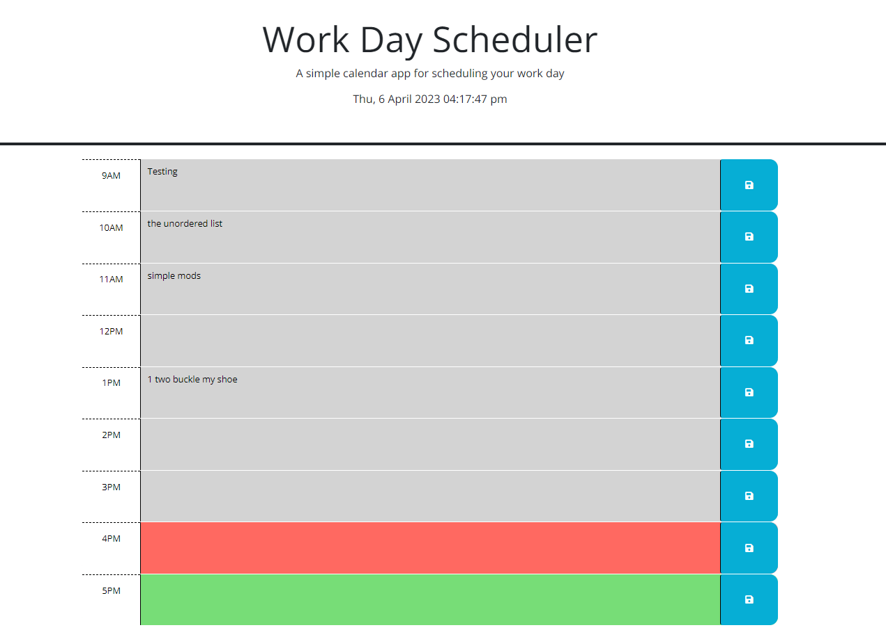

# Work Day Scheduler

## Description
Welcome to the 'Work Day Scheduler'. Here you'll be able to schedule your work day and all of your inputs will be saved! This project consists of HTML, CSS, and JavaScript. Some extensions used are BootStraps and jQuery. Using jQuery, I was able to use date manipulation in order to display the time and use time comparisons. These time comparisons would then indicate which time block is in the past, present, or the future. Another use of jQuery is DOM manipulation. Using DOM manipulation, I was able to pull values from the HTML and save it into local storage. Upon reloading the page, the values that were stored in local storage would then display in their respective time blocks. One challenge that I faced was adjusting to the language of jQuery. Since vanilla JS and jQuery's functions cannot mix, I had to be extremely careful not to accidentally put a vanilla function with a jQuery object.

## Installation
N/A 

## Usage
In order to use the 'Work Day Scheduler', input your tasks into the time block. JavaScript will then take that data and save it into local storage which you can access upon refreshing the screen. The 'Work Day Scheduler' will also show which time blocks are in the past, present, or future in relation to the current time.

## Credits
N/A

## License
Refer to license in repository.

## Screenshots

## Links
GitHub repository: https://github.com/bear-muna/fifth-challenge

Deployed site: https://bear-muna.github.io/fifth-challenge/